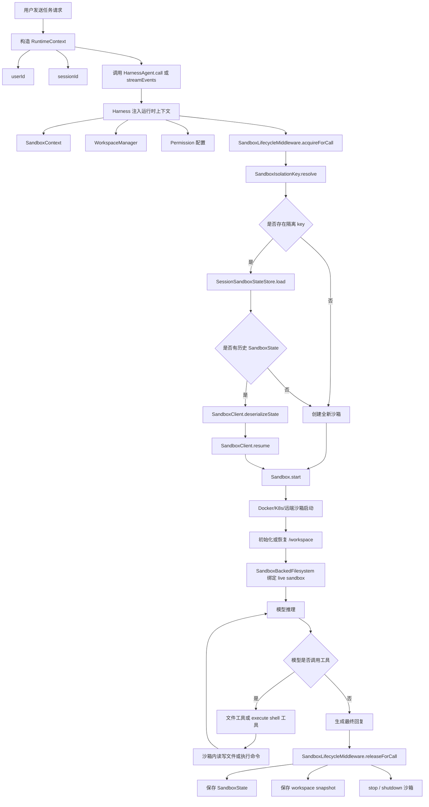
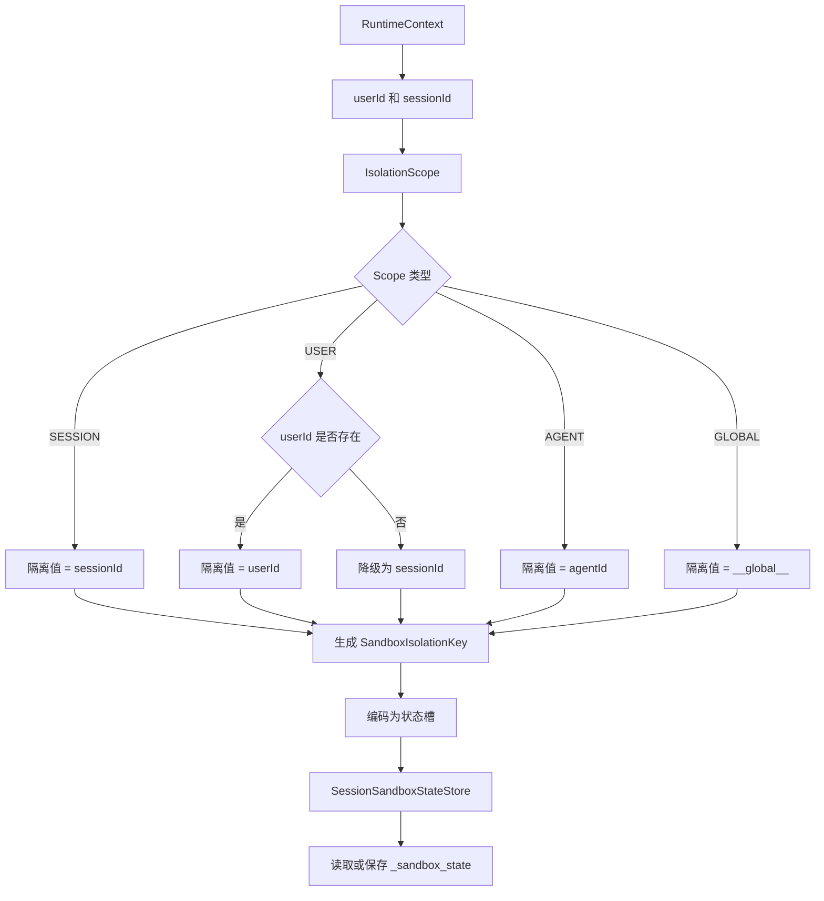
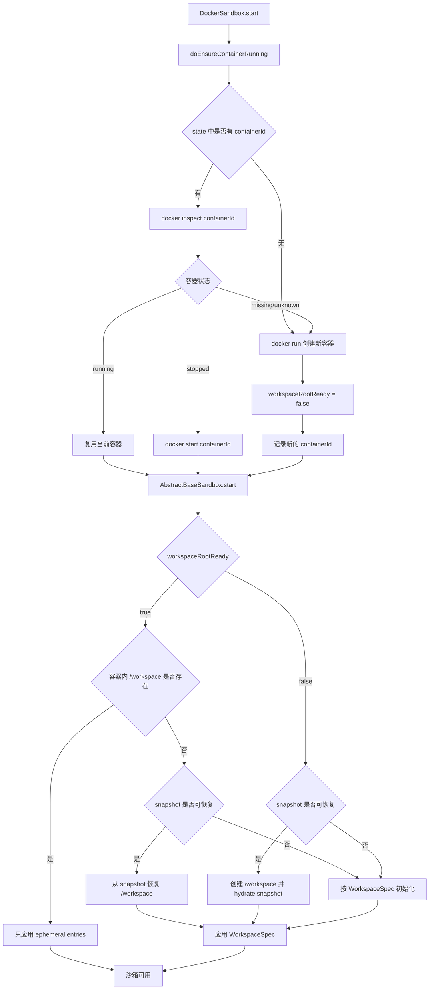
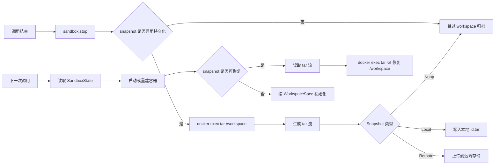

# Harness 如何使用沙箱完成智能体任务执行

本文面向团队内部分享，目标是说明三件事：

1. 什么是沙箱，为什么智能体执行任务需要沙箱。
2. 市面上常见沙箱方案有哪些，它们的能力边界和差异是什么。
3. AgentScope Java 的 `HarnessAgent` 如何把用户请求、工具调用、用户与 session 隔离、沙箱启动、命令执行、快照保存和下一次恢复串成完整流程。

## 什么是沙箱

沙箱是一种隔离运行环境。它允许程序在受控边界内执行命令、读写文件、访问网络或运行用户生成代码，同时限制它对宿主机、其他用户任务、其他会话状态的影响。

在智能体场景中，沙箱尤其重要。因为智能体经常会执行以下动作：

- 克隆仓库。
- 安装依赖。
- 修改代码。
- 运行测试。
- 启动服务。
- 执行模型生成的 shell 命令。
- 读取或生成中间文件。

这些动作如果直接落到宿主机，会带来几个问题：

- 安全风险：模型可能生成危险命令，误删文件或访问敏感路径。
- 环境污染：一次任务安装的依赖、生成的文件可能影响下一次任务。
- 多用户串扰：不同用户或不同 session 之间可能读到彼此的数据。
- 难以恢复：任务执行到一半失败后，很难重新进入相同上下文。
- 难以审计：无法清楚区分哪些文件和命令属于某个智能体任务。

所以沙箱的核心价值是：把智能体的执行环境从宿主机隔离出来，同时给框架提供可控的文件系统、命令执行、网络、资源限制和状态恢复能力。

## 主流沙箱方案

面向智能体执行任务，常见沙箱可以分为几类。

### 本地容器沙箱

代表方案：

- Docker
- Podman
- containerd

核心能力：

- 基于镜像快速创建隔离环境。
- 通过 namespace、cgroup、capabilities 等 Linux 机制隔离进程、文件系统、网络和资源。
- 支持挂载宿主机目录。
- 支持注入环境变量。
- 支持限制 CPU、内存、网络。
- 启动速度快，开发调试方便。

适合场景：

- 本地开发。
- CI 中运行测试。
- 企业内网环境下跑编码 agent。
- 可控任务执行，不需要强多租户安全边界。

主要限制：

- 容器不是完整虚拟机，内核仍由宿主机共享。
- 如果使用 privileged、host network、敏感目录挂载等配置，隔离能力会明显下降。
- 多租户安全要求很高时，通常需要叠加 VM、gVisor、Kata 或独立节点隔离。

### Kubernetes 沙箱

代表方案：

- Kubernetes Pod
- 基于 Kubernetes 的任务执行平台
- AgentScope 中的 Kubernetes sandbox 扩展

核心能力：

- 以 Pod 作为调度和运行单元。
- 可以用 namespace、service account、network policy、resource quota 控制权限和资源。
- 适合分布式、弹性、长时间运行任务。
- 可以结合 PVC、对象存储、日志系统和监控系统。

适合场景：

- 多节点部署。
- 企业级任务调度。
- 需要横向扩展大量智能体任务。
- 需要统一接入云原生日志、监控、权限和网络策略。

主要限制：

- 系统复杂度高于本地 Docker。
- 启动速度和调试便利性取决于集群配置。
- Pod 默认仍是容器隔离，如果需要强隔离，通常要配合 Kata Containers、Firecracker、gVisor 或独立节点池。

### 云端托管智能体沙箱

代表方案：

- E2B
- Daytona
- Modal Sandbox
- AgentRun 类服务

核心能力：

- 通过 SDK 或 API 创建沙箱。
- 提供文件读写、命令执行、代码执行、进程管理等接口。
- 部分产品支持持久化、快照、恢复、端口预览、GPU、VM runtime。
- 适合直接接入智能体框架，减少自建基础设施成本。

适合场景：

- 快速搭建 coding agent。
- 需要弹性扩容。
- 不希望维护 Docker/Kubernetes 执行集群。
- 希望通过 API 统一管理 sandbox 生命周期。

主要限制：

- 数据和代码会进入第三方环境，需要评估合规和数据安全。
- 成本、网络连通性、镜像定制能力取决于服务商。
- 与企业内网 Git、制品库、数据库打通时可能需要额外网络方案。

### VM 或 microVM 沙箱

代表方案：

- Firecracker microVM
- Kata Containers
- 云厂商轻量 VM
- 部分 Daytona / Modal VM sandbox

核心能力：

- 用虚拟机边界隔离任务。
- 相比普通容器，隔离强度更高。
- microVM 通常比传统 VM 更轻，启动更快。
- 适合运行不可信代码、多租户任务、需要更强内核隔离的场景。

适合场景：

- 多租户 SaaS。
- 不可信用户代码执行。
- 安全边界要求高的企业环境。
- 需要在沙箱内运行 Docker、FUSE、systemd、eBPF 等更接近完整 Linux 的能力。

主要限制：

- 启动和资源成本通常高于普通容器。
- 镜像、网络、存储和调试复杂度更高。
- 平台建设成本更高。

### 浏览器沙箱和语言级沙箱

代表方案：

- 浏览器 iframe / Web Worker / WebAssembly sandbox
- JavaScript VM 隔离
- Python 子解释器或受限执行环境

核心能力：

- 对特定语言或前端运行环境做细粒度限制。
- 启动快，资源轻。
- 适合执行小段代码、表达式、前端预览或受控脚本。

适合场景：

- 在线代码片段运行。
- 前端预览。
- 数据处理中的小型表达式计算。

主要限制：

- 不是完整操作系统环境。
- 很难支撑真实软件工程任务，例如 Maven 编译、依赖安装、系统命令、服务启动。
- 安全边界高度依赖具体实现。

## 主流方案差异对比

| 类型 | 隔离强度 | 启动速度 | 运维成本 | 是否适合 coding agent | 典型能力 |
| --- | --- | --- | --- | --- | --- |
| 本地 Docker | 中 | 快 | 低 | 适合本地和内网 | 镜像、命令执行、目录挂载、资源限制 |
| Kubernetes Pod | 中到高 | 中 | 高 | 适合规模化 | 调度、资源配额、网络策略、日志监控 |
| 云端托管沙箱 | 取决于厂商 | 快到中 | 低 | 适合快速集成 | API/SDK、文件、命令、快照、预览 |
| VM / microVM | 高 | 中 | 中到高 | 适合强安全场景 | 独立内核、强隔离、完整 Linux 能力 |
| 语言级沙箱 | 低到中 | 很快 | 低 | 只适合小任务 | 代码片段执行、表达式计算 |

对于 AgentScope Harness 来说，关键不是绑定某一种底层技术，而是抽象出统一能力：创建沙箱、恢复沙箱、执行命令、读写文件、保存工作区、清理资源。

## AgentScope Harness 抽象出的沙箱能力

在 AgentScope Java 中，沙箱被抽象成几个核心概念。

### Sandbox

`Sandbox` 表示一个可运行的隔离环境，提供：

- `start()`：启动或恢复沙箱。
- `stop()`：停止当前执行窗口，并保存工作区快照。
- `shutdown()`：释放底层资源，例如停止并删除 Docker 容器。
- `exec(...)`：在沙箱内执行命令。
- `persistWorkspace()`：导出工作目录。
- `hydrateWorkspace(...)`：把工作目录归档恢复进去。
- `getState()`：获取可序列化的沙箱状态。

### SandboxClient

`SandboxClient` 负责创建和恢复沙箱：

- `create(...)`：根据镜像、工作目录、网络、资源等配置创建新沙箱状态。
- `resume(state)`：根据保存的 `SandboxState` 恢复沙箱对象。
- `serializeState(state)`：把沙箱状态序列化保存。
- `deserializeState(json)`：把历史状态反序列化。

Docker、Kubernetes、E2B、Daytona、AgentRun 等后端都可以按这个模型适配。

### SandboxState

`SandboxState` 是可持久化元数据。Docker 场景下会包含：

- sandbox sessionId。
- containerId。
- containerName。
- image。
- workspaceRoot。
- WorkspaceSpec。
- Snapshot 引用。
- workspaceRootReady。
- workspaceProjectionHash。

它保存的是“如何恢复这个沙箱”的信息，不等于完整工作区内容。

### SandboxSnapshot

`SandboxSnapshot` 保存工作区内容。对 Docker 来说，工作区内容来自：

```bash
docker exec <containerId> tar -cf - -C /workspace .
```

恢复时等价于：

```bash
docker exec <containerId> mkdir -p /workspace
docker exec -i <containerId> tar -xf - -C /workspace < snapshot.tar
```

所以 AgentScope 的快照模型是“工作目录 tar 流”，不是 Docker container checkpoint。

### WorkspaceSpec

`WorkspaceSpec` 描述沙箱工作区应该如何初始化，包括：

- 根目录。
- 环境变量。
- 文件。
- 目录。
- 本地文件复制。
- 本地目录复制。
- bind mount。
- workspace projection。

它负责把应用侧准备好的资源投影到沙箱中，让智能体启动后能看到必要的上下文。

## HarnessAgent 执行任务的核心流程图



## 用户和 Session 隔离流程图



状态槽编码规则：

```text
SESSION -> sandbox/session/<sessionId>
USER    -> sandbox/user/<agentId>/<userId>
AGENT   -> sandbox/agent/<agentId>
GLOBAL  -> sandbox/global
```

因此：

- `IsolationScope.SESSION`：同一个用户的不同 session 会进入不同沙箱状态。
- `IsolationScope.USER`：同一个用户的多个 session 会共享一个沙箱状态。
- `IsolationScope.AGENT`：所有用户共享同一个 agent 级沙箱状态。
- `IsolationScope.GLOBAL`：所有调用共享同一个全局沙箱状态。

## Docker 后端的启动与恢复流程

Docker 后端的恢复重点在 `DockerSandbox.start()`。



当历史容器被删除时，源码不会直接失败。它会：

1. `docker inspect` 旧 containerId。
2. 发现容器不存在。
3. 使用历史 state 中的 image、network、env、ports、mounts 等配置重新 `docker run`。
4. 把 `workspaceRootReady` 设为 `false`。
5. 如果 snapshot 可恢复，把工作区 tar 解压回新容器的 `/workspace`。
6. 如果 snapshot 不可恢复，只能重新应用 `WorkspaceSpec`。

## 工具调用如何执行命令

当模型决定调用 shell 工具时，Harness 不会让命令直接在宿主机执行。命令会通过当前调用绑定的 live sandbox 执行。

Docker 场景下，真实执行形式是：

```bash
docker exec -w /workspace <containerId> sh -c '<command>'
```

例如智能体要运行：

```bash
mvn test
```

实际效果是：

```bash
docker exec -w /workspace <containerId> sh -c 'mvn test'
```

这意味着：

- 命令工作目录是沙箱内 `/workspace`。
- 命令依赖沙箱镜像中的环境，例如 JDK、Maven、Git。
- 命令产生的文件默认在沙箱工作区内。
- 如果配置了 snapshot，调用结束后这些文件可以随 `/workspace` 一起保存。

## 什么时候停止和销毁沙箱

在 Harness 自管理模式下，沙箱生命周期围绕一次 agent 调用展开。

调用开始：

```text
acquire -> start -> bind filesystem
```

调用期间：

```text
模型推理 -> 工具调用 -> 沙箱内文件和命令操作
```

调用结束：

```text
persistState -> stop -> shutdown -> unbind filesystem
```

对 Docker 后端而言：

- `stop()`：保存工作区快照，并把 `workspaceRootReady` 标记为 true。
- `shutdown()`：如果容器是 Harness 自管理的，则执行 `docker stop` 和 `docker rm`。

所以默认自管理 Docker 沙箱更接近：

```text
每次调用创建或恢复一个执行环境
调用结束保存状态
随后释放容器资源
下一次再按状态恢复
```

如果使用调用方传入的 `externalSandbox`，Harness 不会销毁它。外部系统可以自己维护“每个用户一个长期容器”或“每个 session 一个长期容器”的策略。

## 快照保存与恢复流程图



需要注意：如果使用默认 no-op snapshot，工作区不会被持久化为 tar。此时如果容器被删除，下一次只能重新初始化 workspace，无法恢复上次运行中生成的文件。

## 一次 coding agent 任务示例

假设调用方配置：

```java
new DockerFilesystemSpec()
        .image("ubuntu:24.04")
        .workspaceRoot("/workspace")
        .workspaceSpec(workspaceSpec)
        .isolationScope(IsolationScope.SESSION)
```

用户请求：

```text
请拉取仓库，修复 Java 测试，并运行 mvn test。
```

执行流程：

```text
1. 调用方创建 RuntimeContext(userId=alice, sessionId=s1)
2. Harness 根据 SESSION 生成隔离 key：sandbox/session/s1
3. SandboxManager 查询这个 key 是否有历史 SandboxState
4. 没有则创建新的 DockerSandboxState
5. DockerSandbox 创建 ubuntu:24.04 容器
6. 初始化 /workspace
7. 模型开始推理
8. 模型调用 shell 工具执行 git clone
9. 模型调用文件工具查看和修改 Java 文件
10. 模型调用 shell 工具执行 mvn test
11. 如果测试失败，模型继续修改代码并重跑测试
12. 调用结束后保存 SandboxState
13. 如果 snapshot 启用，则保存 /workspace tar
14. Docker 容器被 stop 并 rm
```

下一次用户继续同一个 session：

```text
1. RuntimeContext 仍然是 userId=alice, sessionId=s1
2. Harness 再次解析到 sandbox/session/s1
3. 读取上一次保存的 SandboxState
4. 如果旧容器已经删除，则重新 docker run
5. 如果 snapshot 可恢复，则把 /workspace 恢复回来
6. 智能体继续在恢复后的工作区中执行命令
```

如果换成 `IsolationScope.USER`：

```text
alice 的 s1、s2、s3 都会恢复到 sandbox/user/<agentId>/alice
bob 会恢复到 sandbox/user/<agentId>/bob
```

这适合“同一个用户希望跨多个聊天延续同一个工作区”的场景。

如果换成 `IsolationScope.SESSION`：

```text
alice 的 s1、s2、s3 分别是三个独立沙箱状态
```

这适合“每个任务、每个聊天都隔离”的场景。

## 工程选型建议

团队在落地 Harness + Sandbox 时，可以按下面思路选型：

| 场景 | 推荐方案 |
| --- | --- |
| 本地验证框架能力 | Docker sandbox |
| 内网 Git/Maven/JDK 编码任务 | Docker 或 Kubernetes sandbox |
| 多用户、多任务并发 | Kubernetes + 持久化 state store + remote snapshot |
| 不可信用户代码执行 | VM/microVM sandbox 或强隔离容器运行时 |
| 快速接入云端 agent sandbox | E2B、Daytona、Modal 等托管沙箱 |
| 需要跨 session 恢复工作区 | 开启 Local 或 Remote snapshot |
| 只需要一次性执行任务 | Noop snapshot 即可 |

推荐默认策略：

- coding agent 优先使用 `IsolationScope.SESSION`，避免不同任务串扰。
- 如果产品明确需要“同一用户长期工作区”，再使用 `IsolationScope.USER`。
- 生产环境不要依赖默认 no-op snapshot，应该接入 local 或 remote snapshot。
- 多实例部署时，`AgentStateStore` 不应使用纯本地内存，应使用 Redis、数据库或对象存储等共享状态后端。
- 对不可信代码，不要开放 privileged 容器、宿主机敏感目录挂载或 host network。

## 参考资料

- Docker 官方文档：Docker 使用 Linux namespace 提供容器隔离，并通过显式 bind mount 访问宿主机文件。
  <https://docs.docker.com/get-started/docker-overview/>
  <https://docs.docker.com/security/faqs/containers/>
- Kubernetes 官方文档：Pod 是 Kubernetes 中最小可部署单元，共享存储和网络资源，并基于 namespace、cgroup 等机制提供隔离。
  <https://kubernetes.io/docs/concepts/workloads/pods/>
- E2B 官方文档：E2B sandbox 提供隔离云环境，支持文件、目录、命令和代码执行。
  <https://e2b.dev/docs/sdk-reference/code-interpreter-js-sdk/v2.3.1/sandbox>
- Daytona 官方文档：Daytona sandboxes 面向 AI agent，提供隔离运行环境、文件系统、网络、资源与多种 runtime。
  <https://www.daytona.io/docs/en/sandboxes/>
- Modal 官方文档：Modal Sandboxes 用于执行不可信用户或 agent 代码，支持创建 sandbox、执行命令、文件系统和 VM runtime。
  <https://modal.com/docs/guide/sandboxes>
  <https://modal.com/docs/guide/vm-sandboxes>
- Firecracker 官方文档：Firecracker 基于 KVM 提供轻量 microVM，用于 serverless 和多租户工作负载隔离。
  <https://firecracker-microvm.github.io/>

